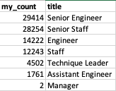
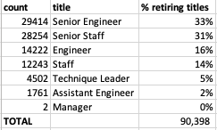
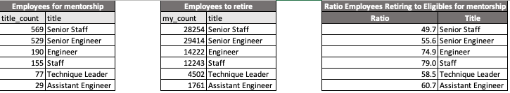

# Pewlett-Hackard-Analysis

## Overview of the Analysis

Using the Pewlett-Hackard csv data files, employees, title & department employee, this analysis aims to determine the number of retiring employees per title and identify eligible employees to participate in a mentorship program to help the company prepare for the "silver tsunami."

## Results of the Analysis 

The four major points from the two analysis deliverables are: 

* 90,398 employees are retiring. 
* Almost 50% of these employees have held more than one title in the company. 
* According to Table 1 - Retirement Titles, 33% of the retire-eligible employees held a Senior Engineer position, followed by Senior Staffs which represent 31% of the employees to retire, 16% are Engineers, 14% Staff, and the remaining are Technique Leaders, Assistant Engineer, and 2 Managers.


#### Table 1 - Retirement Titles 

* There are 1,549 employees eligible for mentorship. 

## Summary 

As the "silver tsunami" begins to impact, there are 90,398 roles that will need to be filled. See Table 2 - Retirement Title Total. 


#### Table 2 - Retirement Title Total

As described in the results above, there are 1,549 employees eligible for mentorship. Using a count query to determine the number of employees eligible for mentorship per title, we can gather that there are enough qualified retirement-ready employees in the departments to mentor the next generation.  For each Senior Staff suitable for mentorship, there are about 49 retire-ready employees that can mentor. For each Senior Engineer to mentor, there are 55 Senior Engineers to retire. For each Engineer to mentor, there are 74 retirings. For each Technique Leader to mentor, 58 are retiring, and for each assistant Engineer, 60 are retiring. See the results tables below. 

### Query to obtain the count of Employees for mentorship by title 
```
SELECT COUNT (me.title) AS title_count,
me.title
INTO mentorship_titles 
FROM mentorship_eligibilty as me
GROUP BY me.title
ORDER BY title_count DESC;
```
### Tables to obtain the ratio employees to retire per title vs employees to mentor




