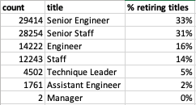

# Pewlett-Hackard-Analysis

*Fig. 1 Theater Outcomes Based on Launch Date.*

## Overview of the Analysis

Using the Pewlett-Hackard csv data files; employees, title & department employee, this analysis aims to determine the number of retiring employees per title, and identify employees who are eligible to participate in a mentorship program to help the company prepare for the "silver tsunami".

## Results of the Analysis 

The four major points from the two analysis deliverables are: 

* There are 90,398 employees reaching retirement. 
* Almost 50% of these employees have held more than one title in the company. 
* According to Table 1 - Retirement Titles, 33% of the retire-eligible employees held a Senir Engineer position, followed by Senior Staffs which represent 31% of the employees to retire, 16% are Engineers, 14% Staff, and the remaining are Technique Leaders, Assistant Engineer and 2 Managers. 

#### Table 1 - Retirement Titles 

* There are 1,549 employees eligible for mentorship. 

## Summary 

As the "silver tsunami" begins to make an impact, as described on Table 2 - Retirement Title Total, there are 90,398 roles that will need to be filled. 

#### Table 2 - Retirement Title Total

As described in the results above, there are 1,549 employees eligible for mentorship. Using a count query to determine the number of employees eligible for mentorship per deparemnts, we can gather that  the Employee_Database_challenge.sql file, write a query to create a Mentorship Eligibility table that holds the employees who are eligible to participate in a mentorship program.

Summary: Provide high-level responses to the following questions, then provide two additional queries or tables that may provide more insight into the upcoming "silver tsunami."
How many roles will need to be filled as the "silver tsunami" begins to make an impact?
Are there enough qualified, retirement-ready employees in the departments to mentor the next generation of Pewlett Hackard employees?

